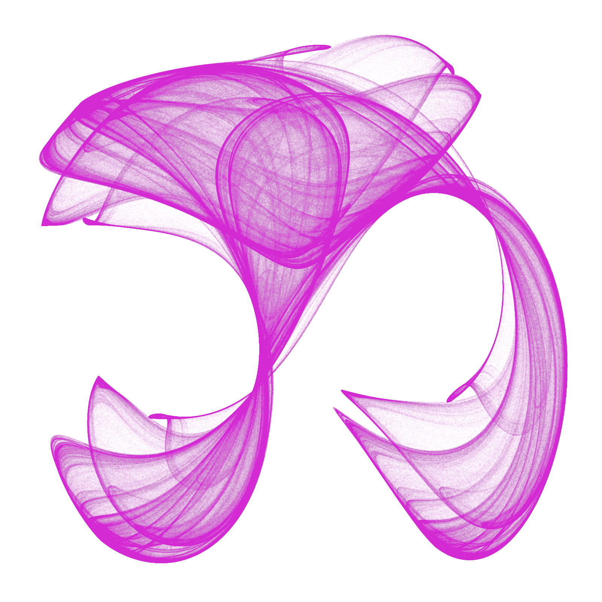

```{r setup, include = FALSE}

# install packages ------------------------------------------------------------------

# install.packages("knitr")
# install.packages("Rcpp")
# install.packages("ggplot2")
# install.packages("here")
# install.packages("png")
# install.packages("grid")
# install.packages("gridExtra")

# load packages ------------------------------------------------------------------

library(knitr)
library(Rcpp)
library(ggplot2)
library(here)
library(png)
library(grid)
library(gridExtra)

# R Markdown ------------------------------------------------------------------

# for each chunk:
opts_chunk$set(
  eval = FALSE, # do not evaluate code in chunks
  echo = FALSE, # do not display the R code
  warning = FALSE, # no package warnings
  message = FALSE, # no package messages
  fig.width = 12, fig.height = 8 # figure size
)

```

# Introduction

My first post is going to be trivial but, I think, quite mesmerizing.   
   
I avidly follow a website called [R-Bloggers](www.r-bloggers.com), a content aggregator where you can find daily updates of a huge variety of blogs treating a plethora of topics. I learned that, thanks to the power of **R**, I could be able to accomplish everything I deem important in life: creating [memes](https://www.r-bloggers.com/creat-meme-in-r/), making [pixel art](https://www.r-bloggers.com/shiny-app-for-making-pixel-art-models/), and generate [sCATterplots](https://www.r-bloggers.com/putting-the-cat-in-scatterplot/). On a slightly more serious note, I discovered extremely interesting blogs, like [***Variance Explained***](http://varianceexplained.org/), and useful R packages, for example [***sjPlot***](https://cran.r-project.org/web/packages/sjPlot/index.html).   
   
# Clifford attractors

Recently, I stumbled upon [this blog post](https://fronkonstin.com/2017/11/07/drawing-10-million-points-with-ggplot-clifford-attractors/) showing how to draw [Clifford A. Pickover's](https://en.wikipedia.org/wiki/Clifford_A._Pickover) strange attractors in R. They are defined by the following equations:   
   
$$ x_{n+1} = sin( \textbf{a} y_{n} ) + \textbf{c} cos( \textbf{a} x_{n} ) $$   
$$ y_{n+1} = sin( \textbf{b} x_{n} ) + \textbf{d} cos( \textbf{b} y_{n} ) $$   
   
```{r attractor, eval = TRUE}

# custom ggplot2 minimalist theme
opt <- theme(
  legend.position = "none",
  panel.background = element_rect(fill = "white"),
  axis.ticks = element_blank(),
  panel.grid = element_blank(),
  axis.title = element_blank(),
  axis.text = element_blank()
)

# draw the position of each point (starting from positions x and y) using Pickover's equations
cppFunction('DataFrame createTrajectory(int n, double x0, double y0, 
            double a, double b, double c, double d) {
            // create the columns
            NumericVector x(n);
            NumericVector y(n);
            x[0]=x0;
            y[0]=y0;
            for(int i = 1; i < n; ++i) {
            x[i] = sin(a*y[i-1])+c*cos(a*x[i-1]);
            y[i] = sin(b*x[i-1])+d*cos(b*y[i-1]);
            }
            // return a new data frame
            return DataFrame::create(_["x"]= x, _["y"]= y);
            }
            ')

# assign values to free parameters
a <- 1.5
b <- -1.8
c <- 1.6
d <- 0.9

```

The free parameters (in bold) define each attractor. When using $\textbf{a}$ = `r a`, $\textbf{b}$ = `r b`, $\textbf{c}$ = `r c`, and $\textbf{d}$ = `r d` -- sequentially through 1,000,000[^1] steps -- the result looks like this:

```{r Clifford, fig.cap = '**Figure 1.** *My first Clifford attractor.*'}

df <- createTrajectory(1000000, 0, 0, a, b, c, d) # create the cloud of points (starting from position [x = 0, y = 0]
attractor <- ggplot(df, aes(x, y)) + geom_point(color = "black", shape = 46, alpha = .01) + opt
png(here("static/img/attractor.png"), units = "px", width = 1600, height = 1600, res = 300) # save as .png
attractor
dev.off() # close device

```


   
This is sweet, but something is missing... perhaps there are not enough points. Let's use 10,000,000!

```{r Clifford_black, fig.cap = '***Figure 2.*** *A nice-looking Clifford attractor.*'}

df.black <- createTrajectory(10000000, 0, 0, a, b, c, d)
attractor.black <- ggplot(df.black, aes(x, y)) +
  geom_point(color = "black", shape = 46, alpha = .01) +
  opt
png(here("static/img/attractor_black.png"), units = "px", width = 1600, height = 1600, res = 300)
attractor.black
dev.off()

```


   
That's more like it. Now let's make another attractor, using 10,000,000 magenta points.

```{r Clifford_magenta, fig.cap = '***Figure 3.*** *A magenta Clifford attractor.*'}

a.mag <- -1.4
b.mag <- 1.6
c.mag <- 1.0
d.mag <- 0.7
df.mag <- createTrajectory(10000000, 0, 0, a.mag, b.mag, c.mag, d.mag)
attractor.mag <- ggplot(df.mag, aes(x, y)) + geom_point(color = "#e017e0", shape = 46, alpha = .01) + opt
png(here("static/img/attractor_mag.png"), units = "px", width = 1600, height = 1600, res = 300)
attractor.mag
dev.off()

```



Oh yeah, that's juicy[^2].   
   
I've got an idea: let's make a few more, and then overlay them!

```{r Clifford_overlay, fig.cap = '***Figure 4.*** *Black, magenta, blue, and golden Clifford attractors!*'}

a.blue <- -1.8
b.blue <- 1.8
c.blue <- 0.9
d.blue <- 0.7
df.blue <- createTrajectory(10000000, 0, 0, a.blue, b.blue, c.blue, d.blue)
attractor.blue <- ggplot(df.blue, aes(x, y)) + geom_point(color = "#2570da", shape = 46, alpha = .01) + opt
png(here("static/img/attractor_blue.png"), units = "px", width = 1600, height = 1600, res = 300)
attractor.blue
dev.off()

a.gold <- -1.2
b.gold <- 1.7
c.gold <- 0.9
d.gold <- 0.6
df.gold <- createTrajectory(10000000, 0, 0, a.gold, b.gold, c.gold, d.gold)
attractor.gold <- ggplot(df.gold, aes(x, y)) + geom_point(color = "#cd7f32", shape = 46, alpha = .01) + opt
png(here("static/img/attractor_gold.png"), units = "px", width = 1600, height = 1600, res = 300)
attractor.gold
dev.off()

attractor.black <- readPNG(here("static/img/attractor_black.png"))
attractor.mag <- readPNG(here("static/img/attractor_mag.png"))
attractor.blue <- readPNG(here("static/img/attractor_blue.png"))
attractor.gold <- readPNG(here("static/img/attractor_gold.png"))

attractor.black.raster <- matrix(rgb(attractor.black[, , 1], attractor.black[, , 2], attractor.black[, , 3], alpha = 1), nrow = dim(attractor.black)[1])
attractor.mag.raster <- matrix(rgb(attractor.mag[, , 1], attractor.mag[, , 2], attractor.mag[, , 3], alpha = .6), nrow = dim(attractor.mag)[1])
attractor.blue.raster <- matrix(rgb(attractor.blue[, , 1], attractor.blue[, , 2], attractor.blue[, , 3], alpha = .6), nrow = dim(attractor.blue)[1])
attractor.gold.raster <- matrix(rgb(attractor.gold[, , 1], attractor.gold[, , 2], attractor.gold[, , 3], alpha = .6), nrow = dim(attractor.gold)[1])

overlay <- ggplot(data.frame()) +
  annotation_custom(rasterGrob(attractor.black.raster)) +
  annotation_custom(rasterGrob(attractor.mag.raster)) +
  annotation_custom(rasterGrob(attractor.blue.raster)) +
  annotation_custom(rasterGrob(attractor.gold.raster)) +
  opt

png(here("static/img/overlay.png"), units = "px", width = 1600, height = 1600, res = 300)
overlay
dev.off()

```


Fantastic. This took a long time but... totally worth the effort!

***
***

In case you want to waste countless hours hunting for the perfect Clifford attractor, here is the code:

```{r Clifford_code, echo = TRUE}

##### CREATE A CLIFFORD ATTRACTOR #####

# load packages
library(Rcpp)
library(ggplot2)
library(png)

# custom ggplot2 minimalist theme
opt <- theme(
  legend.position = "none",
  panel.background = element_rect(fill = "white"),
  axis.ticks = element_blank(),
  panel.grid = element_blank(),
  axis.title = element_blank(),
  axis.text = element_blank()
)

# function drawing the position of each point (starting from positions x and y) using Pickover's equations
cppFunction('DataFrame createTrajectory(int n, double x0, double y0, 
            double a, double b, double c, double d) {
            // create the columns
            NumericVector x(n);
            NumericVector y(n);
            x[0]=x0;
            y[0]=y0;
            for(int i = 1; i < n; ++i) {
            x[i] = sin(a*y[i-1])+c*cos(a*x[i-1]);
            y[i] = sin(b*x[i-1])+d*cos(b*y[i-1]);
            }
            // return a new data frame
            return DataFrame::create(_["x"]= x, _["y"]= y);
            }
            ')

# assign values to free parameters
# black attractor
a <- 1.5
b <- -1.8
c <- 1.6
d <- 0.9
# # magenta attractor
# a <- -1.4
# b <- 1.6
# c <- 1.0
# d <- 0.7
# # blue attractor
# a <- -1.8
# b <- 1.8
# c <- 0.9
# d <- 0.7
# # gold attractor
# a <- -1.2
# b <- 1.7
# c <- 0.9
# d <- 0.6

df <- createTrajectory(10000000, 0, 0, a, b, c, d) # calculate the coordinates of 10,000,000 points (starting from position [x = 0, y = 0]
attractor <- ggplot(df, aes(x, y)) +
  geom_point(color = "black", shape = 46, alpha = .01) +
  opt # create the graph
# magenta attractor: color="#e017e0"
# blue attractor: color="#2570da"
# gold attractor: color="#cd7f32"

# save as .png
png("attractor.png", units = "px", width = 1600, height = 1600, res = 300)
attractor
dev.off() # close device

##### OVERLAY ATTRACTORS #####

# load packages
library(grid)
library(gridExtra)

# assuming attractors are saved in separate .png files...
# load images
attractor.black <- readPNG("attractor_black.png")
attractor.mag <- readPNG("attractor_mag.png")
attractor.blue <- readPNG("attractor_blue.png")
attractor.gold <- readPNG("attractor_gold.png")

# convert to raster
# (play with the alpha levels to modify transparency)
attractor.black.raster <- matrix(rgb(attractor.black[, , 1], attractor.black[, , 2], attractor.black[, , 3], alpha = 1), nrow = dim(attractor.black)[1])
attractor.mag.raster <- matrix(rgb(attractor.mag[, , 1], attractor.mag[, , 2], attractor.mag[, , 3], alpha = .6), nrow = dim(attractor.mag)[1])
attractor.blue.raster <- matrix(rgb(attractor.blue[, , 1], attractor.blue[, , 2], attractor.blue[, , 3], alpha = .6), nrow = dim(attractor.blue)[1])
attractor.gold.raster <- matrix(rgb(attractor.gold[, , 1], attractor.gold[, , 2], attractor.gold[, , 3], alpha = .6), nrow = dim(attractor.gold)[1])

# overlay all images as different static annotations in a ggplot2 object
overlay <- ggplot(data.frame()) +
  annotation_custom(rasterGrob(attractor.black.raster)) +
  annotation_custom(rasterGrob(attractor.mag.raster)) +
  annotation_custom(rasterGrob(attractor.blue.raster)) +
  annotation_custom(rasterGrob(attractor.gold.raster)) +
  opt

# save as .png
png("overlay.png", units = "px", width = 1600, height = 1600, res = 300)
overlay
dev.off()
dev.off()

```

[^1]: 
[^2]: For other captivating examples, see [here](https://paulbourke.net/fractals/clifford/).


