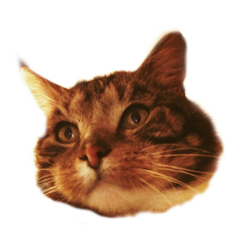
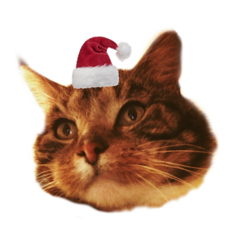
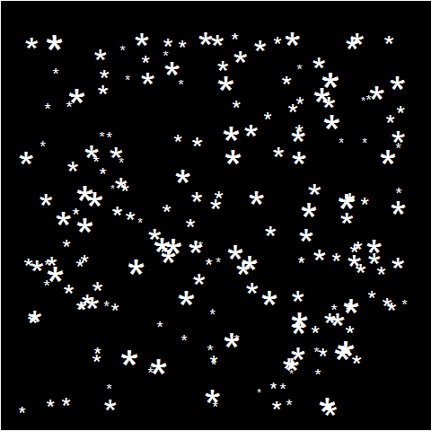

```{r setup, include = FALSE}

# install packages ------------------------------------------------------------------

# install.packages("knitr")
# install.packages("tidyverse")
# install.packages("magick")
# install.packages("gganimate")

# load packages ------------------------------------------------------------------

library(knitr)
library(tidyverse)
library(magick)
library(gganimate)

# R Markdown ------------------------------------------------------------------

# for each chunk:
opts_chunk$set(
  echo = FALSE, # do not display the R code
  warning = FALSE, # no package warnings
  message = FALSE, # no package messages
  fig.width = 12, fig.height = 8 # figure size
)

```


In my first post I broke the ice by drawing mesmerizing [Clifford attractors](/post/2017-11-19-attractive-attractor/). My second post was supposed to be slightly more serious (e.g., something about data analysis, or what I think about the recent [alpha wars](http://sometimesimwrong.typepad.com/wrong/2017/07/alpha-wars.html)), but I have not yet had the time... and my crippling perfectionism is surely not helping.   
   
So, what better way to procrastinate than to play with two of my favorite things in the world, **R** and our cat **Borre**[^1]?   
   
I set out to create a silly image that is probably going to haunt me in my future job interviews[^2]. The initial inspiration came from a picture that my partner Inez[^3] modified for a gift we recently contributed to (yes, Lien, I'm talking about you):



The holidays are approaching, so we thought of adding a small Christmas hat on that big head (our very own [Yule cat](https://en.wikipedia.org/wiki/Yule_Cat)):



A simple white background was not enough. We needed something more appropriate for this period of the year... ah, yes! Snow!   
   
In a recent tweet, [Ilya Kashnitsky](https://twitter.com/ikashnitsky) showed how to create static snow flakes on a dark background. 

**EDIT 2025-01-26**: In the original post, I could link directly to the tweet. However, due to Elon Musk's [enshittification](https://en.wikipedia.org/wiki/Enshittification) of the platform, the tweet or the whole account might have been deleted. I cannot verify because I am no longer on Twitter.

```{r tweet_Kashnitsky, echo = FALSE, eval = FALSE}

blogdown::shortcode('tweet', '937786580231696384')

```

I slightly modified the code to have more snow flakes but, more importantly, I animated the plot using [```gganimate```](https://github.com/dgrtwo/gganimate):



Finally, I used [```magick```](https://cran.r-project.org/web/packages/magick/index.html) to blur Borre's face (to make it even more ethereal) and overlay it on the animated snow:


The end result is a big flat face fluctuating in the air, like a spooky and ominous reminder of our mortality even in these days of opulence.   

<center> <h1>**Happy holidays!**</h1> </center>

***
***

## EDIT December 19th, 2017

[Paul van der Laken](https://paulvanderlaken.com/) just posted a much better version of the animated snow flakes. 

**EDIT 2025-01-26**: Same as above: in the original post, I could link directly to the tweet, but now it is no longer available.

```{r tweet_van_der_Laken, echo = FALSE, eval = FALSE}

blogdown::shortcode('tweet', '943052409043062784')

```

I only want the best for my furry boy and his floating flat face, so I modified my initial script and added van der Laken's snow. Here is the result:


Excitement!

***
***

Below you will find the code to reproduce this silly festive figure... try with a picture of your own (or somebody else's) favorite pet!

```{r Yule_Borre, eval = FALSE, echo = TRUE}

##### Create Borre in the snow #####

# load relevant packages
library(tidyverse)
library(magick)
library(gganimate)

# create snow
# (from https://gist.github.com/ikashnitsky/657ddd6494dca6ddd23e7564234a5ff5)

n <- 19200 # number of snow flakes
nframes <- n / 200 # number of frames for animation

snow <- data.frame(
  x = runif(n), # x coordinates
  y = runif(n), # y coordinates
  size = runif(n, min = 4, max = 20), # variable snow flake size
  frames = rep(1:nframes, each = n / nframes) # number of frames
)

# non-animated plot
snowplot <- ggplot(snow, aes(x, y, size = size, frame = frames)) +
  geom_point(color = "white", pch = 42) +
  scale_size_identity() +
  coord_cartesian(c(0, 1), c(0, 1)) +
  theme_void() +
  theme(
    panel.background = element_rect("black"),
    plot.background = element_rect("black")
  )

# The communication between ImageMagick and the 'magick' package can be tricky.
# In my case, "convert.exe" is not recognized as an internal or external command.
# The following line takes care of that
# (solution found on https://gis.stackexchange.com/questions/259553/problems-in-producing-animation-gif-files-in-r)
Sys.setenv(PATH = paste("E:/R_workspace/ImageMagick-7.0.7-14/", # path where you installed ImageMagick
  Sys.getenv("PATH"),
  sep = ";"
))

snowplot.gif <- gganimate(snowplot, # plot to animate
  "snow.gif", # save as .gif
  title_frame = FALSE, # do not title each image with the current frame value
  interval = .3 # time between frames (in seconds)
)

# read back .gif using Magick
snowplot.gif <- image_read("snow.gif") # load snow

yule.borre <- image_read("yule_borre.png") %>% # load Borre
  image_blur(., 2, 5) # blur Borre to make him even more ethereal

image_composite(snowplot.gif, # snow
  yule.borre, # Borre
  # put Borre in the center of the image
  offset = paste0(
    "+", unique(image_info(snowplot.gif))$width / 6, "+",
    unique(image_info(snowplot.gif))$width / 6
  ),
  operator = "blend", # blend the two images (allows transparency)
  compose_args = "90" # transparency level
) %>%
  image_write(., path = "snow_borre.gif", format = "gif") # save as .gif

##################################################################################
############################ EDIT DEC. 19TH, 2017 ################################
##################################################################################

# from https://paulvanderlaken.com/2017/12/18/generate-snow-in-r/
# parameters
n <- 200 # number of snow flakes
times <- 100 # number of images for .gif
xstart <- runif(n, max = 1) # random flake start (x coordinates)
ystart <- runif(n, max = 1.1) # random flake start (y coordinates)
size <- runif(n, min = 4, max = 20) # variable snow flake size
xspeed <- seq(-0.02, 0.02, length.out = 100) # flake shift speeds to randomly pick from
yspeed <- runif(n, min = 0.005, max = 0.025) # random flake fall speed

# create storage vectors
xpos <- rep(NA, n * times)
ypos <- rep(NA, n * times)

# loop through simulations
for (i in seq(times)) {
  if (i == 1) {
    # initiate values
    xpos[1:n] <- xstart
    ypos[1:n] <- ystart
  } else {
    # specify datapoints to update
    first_obs <- (n * i - n + 1)
    last_obs <- (n * i)
    # update x position
    # random shift
    xpos[first_obs:last_obs] <- xpos[(first_obs - n):(last_obs - n)] - sample(xspeed, n, TRUE)
    # update y position
    # lower by yspeed
    ypos[first_obs:last_obs] <- ypos[(first_obs - n):(last_obs - n)] - yspeed
    # reset if passed bottom screen
    xpos <- ifelse(ypos < -0.1, runif(n), xpos) # restart at random x
    ypos <- ifelse(ypos < -0.1, 1.1, ypos) # restart just above top
  }
}

# store in dataframe
data_fluid <- cbind.data.frame(
  x = xpos,
  y = ypos,
  s = size,
  t = rep(1:times, each = n)
)

# create animation
better.snow <- data_fluid %>%
  ggplot(aes(x, y, size = s, frame = t)) +
  geom_point(color = "white", pch = 42) +
  scale_size_identity() +
  coord_cartesian(c(0, 1), c(0, 1)) +
  theme_void() +
  theme(
    panel.background = element_rect("black"),
    plot.background = element_rect("black")
  )

better.snowplot.gif <- gganimate(better.snow, # plot to animate
  filename = "bettersnow.gif", # save as .gif
  title_frame = FALSE, # do not title each image with the current frame value
  interval = .1 # time between frames (in seconds)
)

# read back .gif using Magick
better.snowplot.gif <- image_read("bettersnow.gif") # load snow

yule.borre <- image_read("yule_borre.png") %>% # load Borre
  image_blur(., 2, 5) # blur Borre to make him even more ethereal

image_composite(better.snowplot.gif, # snow
  yule.borre, # Borre
  # put Borre in the center of the image
  offset = paste0(
    "+", unique(image_info(better.snowplot.gif))$width / 6, "+",
    unique(image_info(better.snowplot.gif))$width / 6
  ),
  operator = "blend", # blend the two images (allows transparency)
  compose_args = "90" # transparency level
) %>%
  image_write(., path = "better_snow_borre.gif", format = "gif") # save as .gif

```

[^1]: Borre, a.k.a. Borremans De Struise, is a lovable and popular chap. For a while, he even had an Instagram account, but he decided to delete it due to privacy concerns.
[^2]: Yeah, I like living on the edge.
[^3]: Besides being quite good with [GIMP](https://www.gimp.org/) (see [here](https://www.facebook.com/photo.php?fbid=10214720300938055&set=a.1592053558148.2090722.1140170478&type=3&theater) for one of her silly creations), Inez is a very, very good artist: you can follow her on [Facebook](https://www.facebook.com/olievlek/), visit her [website](https://inezmgreven.wixsite.com/olievlek), and buy her drawings & paintings on [Etsy](https://www.etsy.com/shop/inezolievlek).


