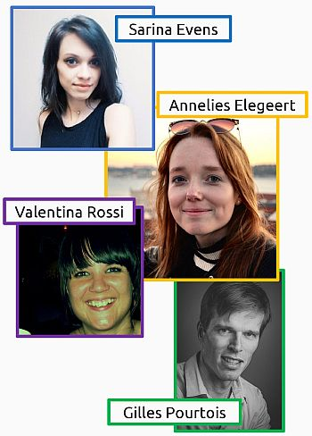

```{r setup, include=FALSE}
# use pacman to install and load relevant packages
pacman::p_load("knitr", # dynamic report generation
               "here", # constructs paths to your project's files
               "Rmisc", # for advanced summary functions
               # WARNING: "Rmisc" requires "plyr", which gives problems with group_by function in "dplyr"
               # --> solution: load "dplyr" (part of "tidyverse") after "plyr"
               "tidyverse", # install the following packages: ggplot2, tibble, tidyr, readr, purrr, dplyr
               "ggthemes", # more themes for ggplot2
               "grid", # for plot annotations
               "brms", # Bayesian Regression Models using Stan
               "bayesplot") # Plotting for Bayesian Models

options(htmltools.dir.version=FALSE)
```

layout: true

<!-- set header -->
<div class="my-header"></div>

<!-- set footer -->
<div class="my-footer"><span>Antonio Schettino   
&emsp;&emsp;&emsp;&emsp;&emsp;&emsp;&emsp;&emsp;&emsp;&emsp;&emsp;&emsp;&emsp;
&emsp;&emsp;&emsp;&emsp;&emsp;&emsp;&emsp;&emsp;&emsp;&emsp;&emsp;&emsp;&emsp;
&emsp;&emsp;&emsp;&emsp;&emsp;&emsp;&emsp;&emsp;&emsp;&emsp;&emsp;&emsp;&emsp;
&emsp;&emsp;&emsp;&emsp;&emsp;&emsp;&emsp;
Bayes@Lund - 12.04.2018</span></div>

<!-- ################################### -->
<!-- ############# OUTLINE ############# -->
<!-- ################################### -->

<!-- ##################################################### NOTES ################################################################## -->
<!-- Good day everyone, my name is Antonio Schettino and I am a post-doctoral researcher at Ghent University.                       -->
<!-- Today I will show you the analyses (in progress) of some data collected during an experiment on involuntary spatial attention. -->
<!-- These analyses are conducted in R using the package brms by Paul Buerkner, one of the keynote speakers of this meeting.        -->
<!-- ############################################################################################################################## -->

<!-- ##################################################### NOTES ################################################################## -->
<!-- I will first give a broad background on what we are investigating.                                                             -->
<!-- Then I will show the experimental paradigm we used to address the issue.                                                       -->
<!-- I will then show you the data and mention what kind of analysis we performed.                                                  -->
<!-- Finally, I will give an overview of what we were able to learn with these analyses.                                            -->
<!-- ############################################################################################################################## -->
---
name: outline

<Div style="margin-top:90px" /> <!-- start below university header -->

.left[
  .font200[
    **OUTLINE**
  ]
]

<br />

.font120[
  * background
]

.font120[
  * experimental paradigm
]

.font120[
  * data and results
]

.font120[
  * conclusions
]

<!-- ##################################################### NOTES ################################################################## -->
<!-- Before starting, I would like to acknowledge the contribution of these people.                                                 -->
<!-- Sarina Evens collected the data of the pilot study and crafted a remarkable master thesis,                                     -->
<!-- which you can find on the Open Science Framework (https://osf.io/azh5r/).                                                      -->
<!-- Annelies Elegeert collected the data of the experiment I will present today.                                                   -->
<!-- Valentina Rossi and Gilles Pourtois are long-time collaborators                                                                -->
<!-- who helped with the experimental design and framing the theoretical background.                                                -->
<!-- ############################################################################################################################## -->
--
<!-- add collaborators picture -->
<Div style="margin-top:-380px" />

.right[
  
]

<!-- ################################### -->
<!-- ############ BACKGROUND ########### -->
<!-- ################################### -->

<!-- ##################################################### NOTES ################################################################## -->
<!-- Let's start by clarifying what we wanted to study: involuntary attention.                                                      -->
<!-- Instead of giving a definition, perhaps a video might show this process more intuitively.                                      -->
<!-- ############################################################################################################################## -->
---
name: notification_trolling

<Div style="margin-top:90px" /> <!-- start below university header -->

.center[
  .font200[**Involuntary attention**
  ]
]

<br />

<!-- add video -->
.center[
  <body>
  <video width="320" height="240" controls="controls" vid.autoplay="false">
  <source src="notification_troll.mp4" type="video/mp4">
  <object data="" width="320" height="240">
  <embed width="320" height="240" src="notification_troll.mp4">
  </object></video></body>
  <br /><br />
  source: https://www.youtube.com/watch?v=0M2L9XNYfLs
]

<!-- ##################################################### NOTES ################################################################## -->
<!-- So, what happened here?                                                                                                        -->
<!-- The guy in the background was attracted to the phone despite knowing that his friend was making the notification sounds.       -->
<!-- In other words, his attention was automatically attracted to his phone. Note that these sounds were not just uninformative     -->
<!-- (they were not signalling a real message), but were counterproductive,                                                         -->
<!-- because they distracted him from his current task (watching TV).                                                               -->
<!-- ############################################################################################################################## -->
---
name: clarify_example1

<Div style="margin-top:90px" /> <!-- start below university header -->

.center[
  .font200[**What happened?**
  ]
]

--

.font120[
  * The guy in the background was attracted to the phone...
]

--

.font120[
  * ... despite *knowing* that his friend was making the notification sounds
]

--

.font120[
  * His attention was **automatically** attracted to ~~uninformative~~ **counterproductive** sounds (distraction from current task: watching TV)
]

<!-- ##################################################### NOTES ################################################################## -->
<!-- This is just a funny example, but involuntary attention can also lead to dangerous consequences in real life.                  -->
<!-- For example, imagine driving your car in a busy road and suddenly being distracted by a flash on your mobile phone.            -->
<!-- You could cause an accident.                                                                                                   -->
<!-- Imagine a worker operating a hydraulic press and being distracted by a blinking light. They could get seriously injured.       -->
<!-- We need to understand this phenomenon deeply, but first we need to do it in controlled situations.                             -->
<!-- So how can we study it in the lab?                                                                                             -->
<!-- ############################################################################################################################## -->
---
name: clarify_example2

<Div style="margin-top:90px" /> <!-- start below university header -->

.center[
  .font200[**Why study involuntary attention?**
  ]
]

.font120[
  * Involuntary attentional orienting can be dangerous in some real-life situations
]

--

.font120[
  *  Car driver distracted by flashing mobile phone, worker operating heavy machinery distracted by blinking lights, ...
]

--

.font120[
  * How to study this phenomenon in the lab?
]

<!-- ################################### -->
<!-- ###### EXPERIMENTAL PARADIGM ###### -->
<!-- ################################### -->

<!-- ##################################################### NOTES ################################################################## -->
<!-- One way would be to use a temporal order judgment task.                                                                        -->
<!-- In the simplest version of this experimental paradigm, two stimuli are briefly flashed on the screen and                       -->
<!-- observers have to say which stimulus appeared first.                                                                           -->
<!-- Difficulty varies as a function of Stimulus Onset Asynchrony (SOA), which is the time between the onset of the stimuli.        -->
<!-- ############################################################################################################################## -->
---
name: TOJ

<Div style="margin-top:90px" /> <!-- start below university header -->

.center[
  .font200[**Temporal Order Judgment (TOJ)**
  ]
]

--

.font120[
  * Flash two stimuli on screen
]

--

.font120[
  * Task: which stimulus appeared **first**?
]

--

.font120[
  * Difficulty depends on the time between the onset of the stimuli (**SOA**)
]

<!-- ##################################################### NOTES ################################################################## -->
<!-- This is an example of an easy trial.                                                                                           -->
<!-- Here the first stimulus (vertical lines) appear on the right side, followed by the second stimulus (horizontal lines).         -->
<!-- Participants have to judge which lines appear first.                                                                           -->
<!-- Changing the time between the onset of the two stimuli makes it easier or more difficult.                                      -->
<!-- Here timing is not correct due to technical limitations of the presentation, but at least you get my point.                    -->
<!-- ############################################################################################################################## -->
---
name: TOJ_example
background-image: url("TOJ_video.gif")
background-size: 700px
background-position: 50% 65%

<Div style="margin-top:90px" /> <!-- start below university header -->

.center[
  .font200[**Temporal Order Judgment (TOJ)**
  ]
]

<!-- ##################################################### NOTES ################################################################## -->
<!-- In our modified version of this paradigm, we use an exogenous cue to attract attention to one of the two placeholders.         -->
<!-- This creates the illusion of perceiving the stimulus at the attended location as appearing first even when it's not true.      -->
<!-- Now, what would happen if we present a cue that is always wrong, always appearing on the location of the second stimulus?      -->
<!-- Would participants' attention still automatically shift towards that location, even though it's counterproductive?             -->
<!-- This would be strong evidence that people cannot suppress this automatic urge to look at the cued location.                    -->
<!-- ############################################################################################################################## -->
---
name: TOJ_cue

<Div style="margin-top:90px" /> <!-- start below university header -->

.center[
  .font200[**Counterproductive TOJ**
  ]
]

.font120[
  * An **exogenous cue** is used to attract attention towards one placeholder
]

--

.font120[
  * The stimulus on the attended location is perceived as **first** even when appearing second
]

--

.font120[
  * What if the cue is **always wrong**, i.e., appearing on the location of the *second* stimulus?
]

<!-- ##################################################### NOTES ################################################################## -->
<!-- This is an example of this modified paradigm.                                                                                  -->
<!-- Here the cue (a thick placeholder box) appears on the left,                                                                    -->
<!-- then the first stimulus (horizontal lines) appear on the right side,                                                           -->
<!-- followed by the second stimulus (the vertical lines).                                                                          -->
<!-- So, the correct answer would be to judge the horizontal lines as appearing first but,                                          -->
<!-- because of the cue, participants should be more inclined to say that the vertical lines appeared first.                        -->
<!-- Again, timing here is not correct, this example is just to get the point across.                                               -->
<!-- ############################################################################################################################## -->
---
name: TOJ_video_cue
background-image: url("TOJ_video_cue.gif")
background-size: 700px
background-position: 50% 80%

<Div style="margin-top:90px" /> <!-- start below university header -->

.center[
  .font200[**Counterproductive TOJ**
  ]
]

<!-- ################################### -->
<!-- ########## DATA & RESULTS ######### -->
<!-- ################################### -->

<!-- ##################################################### NOTES ################################################################## -->
<!-- This is a visualization of the data.                                                                                           -->
<!-- On the x-axis you see the SOAs. Positive SOAs mean that the horizontal lines were presented first,                             -->
<!-- negative SOAs mean that the vertical lines were presented first.                                                               -->
<!-- On the y-axis you see the proportion of times people judged the horizontal lines as appearing first.                           -->
<!-- X-axis: FACT. Y-axis: PERCEPTION.                                                                                              -->
<!-- The black line represents responses when no cue was presented, our baseline condition.                                         -->
<!-- When the vertical lines appear long before the horizontal lines,                                                               -->
<!-- people should almost never judge the horizontal lines as appearing first. This is what we see here.                            -->
<!-- The shorter the SOA, the more uncertain people are in their judgment. When the stimuli are presented simultaneously,           -->
<!-- there is a 50/50 chance of perceiving the horizontal or vertical lines as first.                                               -->
<!-- What happens when the horizontal lines are cued (blue line)?                                                                   -->
<!-- If the horizontal lines are cued, it means that the vertical lines always appeared first.                                      -->
<!-- However, participants say more often that the horizontal lines appeared first because they were cued.                          -->
<!-- The reverse effect can be seen when the vertical lines were cued.                                                              -->
<!-- ############################################################################################################################## -->
---
name: TOJ_graph

<Div style="margin-top:90px" /> <!-- start below university header -->

.center[
  .font200[**TOJ - Data**
  ]
]

<Div style="margin-top:-40px" />

.center[
```{r TOJ_plot, echo=FALSE, warning=FALSE, message=FALSE, fig.height=4.9, fig.width=7, dev='svg'}
data.exp1 <- read_csv("TOJ_exp1.csv") %>% # load data
  select(participant=Participant, SOA, cue=MainConds, response=Resp) %>% # select and rename variables of interest
  mutate(participant=as.factor(participant), # convert participant as factor
         SOA=recode(factor(SOA), # convert SOA to factor
                    # add "+" to positive SOAs (useful for graphs)
                    "17"="+17",
                    "83"="+83",
                    "150"="+150",
                    "217"="+217"),
         cue=recode(factor(cue), # convert cue to factor and change level names
                    "NoCue"="no.cue", "Horiz1st"="vertical.cued", "Vert1st"="horizontal.cued")) %>%
  group_by(participant, SOA, cue) %>% # groups
  summarize(num.horiz1st=length(which(response==2)), # number of "horizontal first" responses
            tot.trials=length(response==2), # total number of trials
            prop.horizfirst=num.horiz1st/tot.trials) %>% # proportion of "horizontal first" responses
  ungroup()

summary.data.exp1 <- summarySEwithin(data.exp1, # summarize data
                                     measurevar="prop.horizfirst", # dependent variable
                                     withinvars=c("SOA", "cue"), # independent variables
                                     idvar="participant") %>% # ID variable
  select(SOA, cue, prop.horizfirst, CI95.prop=ci) # select and rename variables of interest

# include annotations on x-axis
# (https://stackoverflow.com/questions/31079210/how-can-i-add-annotations-below-the-x-axis-in-ggplot2#31081162)
text.L <- textGrob("vertical lines first", gp=gpar(fontsize=14))
text.R <- textGrob("horizontal lines first", gp=gpar(fontsize=14))

ACC.plot <- ggplot(summary.data.exp1, aes(SOA, prop.horizfirst, group=cue, color=cue, fill=cue)) + # basic graph
  geom_line(size=1.3) + # lines: thickness
  geom_ribbon(aes(ymin=prop.horizfirst-CI95.prop, ymax=prop.horizfirst+CI95.prop), # ribbons (mean +/- 95% CI)
              color="white", # ribbon: color of external line
              alpha=.3) + # ribbon: transparency
  geom_point(aes(shape=cue), # points at each SOA
             fill="white", # point shape: color fill
             size=3) + # point shape: size
  scale_color_manual(values=c("orange", "black", "blue")) + # different line colors per conditions
  scale_fill_manual(values=c("orange", "black", "blue")) + # different ribbon colors per conditions
  scale_x_discrete("SOA", # x-axis: title
                   limits=levels(summary.data.exp1$SOA)) + # x-axis: SOAs (positive are on the right)
  ylab("prop. \"horizontal first\" responses") + # y-axis: title
  scale_y_continuous(breaks=seq(0, 1, .25)) + # x-axis: tick marks
  geom_hline(yintercept=seq(0, 1, .25), # reference lines
             linetype="dotted", # line: type
             colour="#999999", # line: color
             size=.8, # line: thickness
             alpha=.5) + # line: transparency
  annotation_custom(text.L, xmin=2, xmax=2, ymin=-.2, ymax=-.2) + # annotation on x-axis
  annotation_custom(text.R, xmin=8, xmax=8, ymin=-.2, ymax=-.2) + # annotation on x-axis
  theme_pander(base_size=15, pc="white") + # custom theme
  theme(plot.margin=unit(c(1, 1, 2, 1), "lines")) # make room for the annotations

# override clipping
ACC.plot <- ggplot_gtable(ggplot_build(ACC.plot))
ACC.plot$layout$clip[ACC.plot$layout$name == "panel"] <- "off"
grid.draw(ACC.plot)
```
]

<!-- ##################################################### NOTES ################################################################## -->
<!-- We analyzed these data using Bayesian multilevel modeling in brms.                                                             -->
<!-- Because the data were binary (a bunch of 2s and 8s), we fitted multilevel logistic regressions                                 -->
<!-- and allowed participants' intercepts and slopes to vary.                                                                       -->
<!-- On all the parameters of interest, we placed highly informative priors (posterior distributions obtained in a pilot study).    -->
<!-- We fitted several models and quantified which one had the best predictive validity.                                            -->
<!-- Once we identified the winning model, we ran diagnostics and posterior predictive checks and did some hypothesis testing.      -->
<!-- ############################################################################################################################## -->

<!-- Incremental lists do not give me what I want (due to increased font formatting and spacing), -->
<!-- so I created new slides and duplicated the content. Not elegant, but effective.              -->
---
name: TOJ_analysis_desc1

<Div style="margin-top:90px" /> <!-- start below university header -->

.center[
  .font200[**Bayesian multilevel modeling**
  ]
]

---
name: TOJ_analysis_desc2

<Div style="margin-top:90px" /> <!-- start below university header -->

.center[
  .font200[**Bayesian multilevel modeling**
  ]
]

.font120[
* logistic regression, varying intercepts & slopes on *participants*
]

---
name: TOJ_analysis_desc3

<Div style="margin-top:90px" /> <!-- start below university header -->

.center[
  .font200[**Bayesian multilevel modeling**
  ]
]

.font120[
* logistic regression, varying intercepts & slopes on *participants*
* **highly informative priors** (from a pilot study)
]

---
name: TOJ_analysis_desc4

<Div style="margin-top:90px" /> <!-- start below university header -->

.center[
  .font200[**Bayesian multilevel modeling**
  ]
]

.font120[
* logistic regression, varying intercepts & slopes on *participants*
* **highly informative priors** (from a pilot study)
* model comparison:
  1. full model (**SOA** + **cue** + **SOA** x **cue**)
  2. main effects (**SOA** + **cue**)
  3. main effect of **SOA**
  4. main effect of **cue**
  5. **null** model (intercept only)
]

---
name: TOJ_analysis_desc5

<Div style="margin-top:90px" /> <!-- start below university header -->

.center[
  .font200[**Bayesian multilevel modeling**
  ]
]

.font120[
* logistic regression, varying intercepts & slopes on *participants*
* **highly informative priors** (from a pilot study)
* model comparison:
  1. full model (**SOA** + **cue** + **SOA** x **cue**)
  2. main effects (**SOA** + **cue**)
  3. main effect of **SOA**
  4. main effect of **cue**
  5. **null** model (intercept only)
* on the winning model:
  - diagnostics & posterior predictive checks
  - hypothesis testing
]

<!-- ###################################### -->
<!-- #### MODEL SPECIFICATION IN BRMS ##### -->
<!-- ###################################### -->

<!-- ##################################################### NOTES ################################################################## -->
<!-- This is the syntax in brms.                                                                                                    -->
<!--                                                                                                                                -->
<!-- First, you should specify the model formula. Here, the dependent variable is the number of trials                              -->
<!-- in which participants responded "horizontal first" over all trials.                                                            -->
<!-- "Conditions" is the name of the variable containing all condition combinations                                                 -->
<!-- (e.g., no cue at SOA-217, horizontal cued at SOA+83, ...). It is our population-level (or fixed) effect.                       -->
<!--                                                                                                                                -->
<!-- Then we specify the group-level (or random) effects.                                                                           -->
<!-- In this case, we allow intercepts and slopes to vary across participants for each condition combination.                       -->
<!-- What does it practically mean? For example:                                                                                    -->
<!-- - participant 1 could overall be slower than participant 2; or                                                                 -->
<!-- - participant 17 could be faster at SOA 217 but slower at SOA150 compared to participant 19;                                   -->
<!-- - ... you get the idea.                                                                                                        -->
<!-- Here, || is used to prevent group-level correlations from being modeled.                                                       -->
<!--                                                                                                                                -->
<!-- This is the name of the data frame containing your data.                                                                       -->
<!--                                                                                                                                -->
<!-- Here we specify the likelihood function.                                                                                       -->
<!-- The data are a bunch of 2s and 8s (the participant did/didn't respond "horizontal first"), hence the binomial distribution.    -->
<!-- The 'logit' link allows us to interpret the resulting coefficients in terms of odds ratios.                                    -->
<!--                                                                                                                                -->
<!-- Priors.full indicates a list with highly informative priors.                                                                   -->
<!-- We ran a pilot study identical to this one, fitted this same model (with default priors),                                      -->
<!-- and used the posterior distributions of those parameters as priors for this model.                                             -->
<!--                                                                                                                                -->
<!-- We tell brms to extract samples from the priors... they will be useful later on.                                               -->
<!--                                                                                                                                -->
<!-- These settings refer to the No-U-Turn-Sampler (NUTS) in STAN:                                                                  -->
<!-- - inits: initial parameter values in the Markov-Chain Monte Carlo (MCMC) chains;                                               -->
<!-- - control: steps of the NUTS sampler;                                                                                          -->
<!-- - chains: number of MCMC chains;                                                                                               -->
<!-- - iter: number of iterations for each MCMC chain;                                                                              -->
<!-- - warmup: number of burn-in samples (not included in final posterior distribution);                                            -->
<!-- - thin: thinning rate (to decrease autocorrelation);                                                                           -->
<!-- - algorithm: type of sampling algorithm;                                                                                       -->
<!-- - cores: numer of processor cores for parallel computations;                                                                   -->
<!-- - seed: seed for RNG (to ensure reproducible results).                                                                         -->
<!-- For details, see help(brm).                                                                                                    -->
<!-- ############################################################################################################################## -->

<!-- Incremental lists do not give me what I want (due to increased font formatting and spacing), -->
<!-- so I created new slides and duplicated the content. Not elegant, but effective.              -->
---
name: TOJ_analysis_model

<Div style="margin-top:90px" /> <!-- start below university header -->

.center[
  .font200[**Bayesian multilevel modeling with ```brms```**
  ]
]

<Div style="margin-top:-30px" />

```r
##################### full model (SOA * cue) #####################
model.full <- brm(num.horiz1st | trials(tot.trials) ~ SOA * cue +
              (SOA * cue || participant), 
              data = data.TOJ,
              family = binomial("logit"),
              prior = priors.full,
              sample_prior = TRUE,
              inits = "random",
              control = list(adapt_delta = .9),
              chains = 4,
              iter = 2000,
              warmup = 500,
              thin = 1,
              algorithm = "sampling",
              cores = 4,
              seed = 9001)
```

---
name: TOJ_analysis_model_highlight1

<Div style="margin-top:90px" /> <!-- start below university header -->

.center[
  .font200[**Bayesian multilevel modeling with ```brms```**
  ]
]

<Div style="margin-top:-30px" />

```r
##################### full model (SOA * cue) #####################
*   model.full <- brm(num.horiz1st | trials(tot.trials) ~ SOA * cue +
              (SOA * cue || participant),
              data = data.TOJ,
              family = binomial("logit"),
              prior = priors.full,
              sample_prior = TRUE,
              inits = "random",
              control = list(adapt_delta = .9),
              chains = 4,
              iter = 2000,
              warmup = 500,
              thin = 1,
              algorithm = "sampling",
              cores = 4,
              seed = 9001)
```

---
name: TOJ_analysis_model_highlight2

<Div style="margin-top:90px" /> <!-- start below university header -->

.center[
  .font200[**Bayesian multilevel modeling with ```brms```**
  ]
]

<Div style="margin-top:-30px" />

```r
##################### full model (SOA * cue) #####################
model.full <- brm(num.horiz1st | trials(tot.trials) ~ SOA * cue +
*                (SOA * cue || participant),
              data = data.TOJ,
              family = binomial("logit"),
              prior = priors.full,
              sample_prior = TRUE,
              inits = "random",
              control = list(adapt_delta = .9),
              chains = 4,
              iter = 2000,
              warmup = 500,
              thin = 1,
              algorithm = "sampling",
              cores = 4,
              seed = 9001)
```

---
name: TOJ_analysis_model_highlight3

<Div style="margin-top:90px" /> <!-- start below university header -->

.center[
  .font200[**Bayesian multilevel modeling with ```brms```**
  ]
]

<Div style="margin-top:-30px" />

```r
##################### full model (SOA * cue) #####################
model.full <- brm(num.horiz1st | trials(tot.trials) ~ SOA * cue +
              (SOA * cue || participant),
*                data = data.TOJ,
              family = binomial("logit"),
              prior = priors.full,
              sample_prior = TRUE,
              inits = "random",
              control = list(adapt_delta = .9),
              chains = 4,
              iter = 2000,
              warmup = 500,
              thin = 1,
              algorithm = "sampling",
              cores = 4,
              seed = 9001)
```

---
name: TOJ_analysis_model_highlight4

<Div style="margin-top:90px" /> <!-- start below university header -->

.center[
  .font200[**Bayesian multilevel modeling with ```brms```**
  ]
]

<Div style="margin-top:-30px" />

```r
##################### full model (SOA * cue) #####################
model.full <- brm(num.horiz1st | trials(tot.trials) ~ SOA * cue +
              (SOA * cue || participant),
              data = data.TOJ,
*                family = binomial("logit"),
              prior = priors.full,
              sample_prior = TRUE,
              inits = "random",
              control = list(adapt_delta = .9),
              chains = 4,
              iter = 2000,
              warmup = 500,
              thin = 1,
              algorithm = "sampling",
              cores = 4,
              seed = 9001)
```

---
name: TOJ_analysis_model_highlight5

<Div style="margin-top:90px" /> <!-- start below university header -->

.center[
  .font200[**Bayesian multilevel modeling with ```brms```**
  ]
]

<Div style="margin-top:-30px" />

```r
##################### full model (SOA * cue) #####################
model.full <- brm(num.horiz1st | trials(tot.trials) ~ SOA * cue +
              (SOA * cue || participant),
              data = data.TOJ,
              family = binomial("logit"),
*                prior = priors.full,
              sample_prior = TRUE,
              inits = "random",
              control = list(adapt_delta = .9),
              chains = 4,
              iter = 2000,
              warmup = 500,
              thin = 1,
              algorithm = "sampling",
              cores = 4,
              seed = 9001)
```

---
name: TOJ_analysis_model_highlight6

<Div style="margin-top:90px" /> <!-- start below university header -->

.center[
  .font200[**Bayesian multilevel modeling with ```brms```**
  ]
]

<Div style="margin-top:-30px" />

```r
##################### full model (SOA * cue) #####################
model.full <- brm(num.horiz1st | trials(tot.trials) ~ SOA * cue +
              (SOA * cue || participant),
              data = data.TOJ,
              family = binomial("logit"),
              prior = priors.full,
*                sample_prior = TRUE,
              inits = "random",
              control = list(adapt_delta = .9),
              chains = 4,
              iter = 2000,
              warmup = 500,
              thin = 1,
              algorithm = "sampling",
              cores = 4,
              seed = 9001)
```

---
name: TOJ_analysis_model_highlight7

<Div style="margin-top:90px" /> <!-- start below university header -->

.center[
  .font200[**Bayesian multilevel modeling with ```brms```**
  ]
]

<Div style="margin-top:-30px" />

```r
##################### full model (SOA * cue) #####################
model.full <- brm(num.horiz1st | trials(tot.trials) ~ SOA * cue +
              (SOA * cue || participant),
              data = data.TOJ,
              family = binomial("logit"),
              prior = priors.full,
              sample_prior = TRUE,
*                inits = "random",
*                control = list(adapt_delta = .9),
*                chains = 4,
*                iter = 2000,
*                warmup = 500,
*                thin = 1,
*                algorithm = "sampling",
*                cores = 4,
*                seed = 9001)
```

<!-- ##################################################### NOTES ################################################################## -->
<!-- To specify the other models, change the name of the independent variable                                                       -->
<!-- and set the priors of the appropriate model.                                                                                   -->
<!-- ############################################################################################################################## -->
---
name: TOJ_analysis_model_highlight8

<Div style="margin-top:90px" /> <!-- start below university header -->

.center[
  .font200[**Bayesian multilevel modeling with ```brms```**
  ]
]

<Div style="margin-top:-30px" />

```r
##################### main effect of SOA #####################
*   model.SOA <- brm(num.horiz1st | trials(tot.trials) ~ SOA +
*                 (SOA || participant),
              data = data.TOJ,
              family = binomial("logit"),
*                 prior = priors.SOA,
              sample_prior = TRUE,
              inits = "random",
              control = list(adapt_delta = .9),
              chains = 4,
              iter = 2000,
              warmup = 500,
              thin = 1,
              algorithm = "sampling",
              cores = 4,
              seed = 9001)
```

<!-- ##################################################### NOTES ################################################################## -->
<!-- We fitted all the models and compared their out-of-sample predictive validity through leave-one-out cross-validation.          -->
<!-- We iteratively fit each model on all observations except one, and then try to predict the one we left out.                     -->
<!-- The results indicated that the model with the lowest information loss was the one with both main effects, but no interaction.  -->
<!-- In other words, the effects of SOA and cue independently affect responses but do not interact with each other.                 -->
<!-- ############################################################################################################################## -->
---
name: TOJ_LOO

<Div style="margin-top:90px" /> <!-- start below university header -->

.center[
  .font200[**Model comparison with ```brms```**
  ]
]

<Div style="margin-top:-30px" />

.center[
  .font130[(*leave-one-out* cross-validation)
  ]
]

```r
model.comparison <- LOO( # list with all models
                      model.full, model.mains, model.SOA, model.cue, model.null,
                      reloo = TRUE, # exact CV for problematic observations
                      compare = FALSE) # do not compare models with each other
```

.center[
  .font130[
  ```{r model_comparison, echo=FALSE, warning=FALSE, message=FALSE}
        # load results model
        readRDS(here::here("pseudoBMA.rds")) %>%
        select(models=modnames, LOO.IC=ic) %>%
        mutate(LOO.IC=format(LOO.IC, digits=6))
  ```
  ]
]

<!-- ##################################################### NOTES ################################################################## -->
<!-- This is the output that brms gives you.                                                                                        -->
<!-- For brevity, here I am only showing the output of the constant ("fixed") effects.                                              -->
<!-- You can see mean, estimated error, and 95% credible intervals                                                                  -->
<!-- of the posterior distributions of all the parameters of this model (the intercept is SOA0, no cue).                            -->
<!--                                                                                                                                -->
<!-- "Effective sample" is an estimate of the number of independent draws from the posterior distribution.                          -->
<!-- The closer this number is to the total number of samples (in this case, 6,000), the better the estimation.                     -->
<!-- As a rule of thumb, the ratio between the effective and total samples should not be lower than .1.                             -->
<!--                                                                                                                                -->
<!-- "Rhat" measures the ratio of the average variance of samples within each chain                                                 -->
<!-- to the variance of the pooled samples between chains. If all chains converge (i.e., they are at equilibrium), Rhat = 1.        -->
<!-- As a rule of thumb, Rhat should not be higher than 1.05.                                                                       -->
<!-- ############################################################################################################################## -->
---
name: TOJ_analysis_output

<Div style="margin-top:90px" /> <!-- start below university header -->

.center[
  .font200[**```brms``` output**
  ]
]

<Div style="margin-top:-40px" />

.center[
  .font130[(**main effects** model, only **constant** effects)
  ]
]

```{r model_mains, echo=FALSE, warning=FALSE, message=FALSE}
    # load results model
    model.mains <- readRDS(here::here("model_mains.rds"))
    capture.output(model.mains)[36:48]
```

<!-- ##################################################### NOTES ################################################################## -->
<!-- You can visually explore the MCMC chains, to see whether they converged.                                                       -->
<!-- For these representative parameters, the chains converged nicely onto the same parameter space ("fat hairy caterpillar").      -->
<!-- ############################################################################################################################## -->
---
name: TOJ_analysis_MCMCchains

<Div style="margin-top:90px" /> <!-- start below university header -->

.center[
  .font200[**MCMC chains**
  ]
]

<br />
<Div style="margin-left:-50px" />

.pull-left[
  ```r
  library(bayesplot)
  mcmc_trace(as.array(model.mains),
  pars = c("b_Intercept", 
    "b_cuevertical.cued", 
    "b_cuehorizontal.cued"),
  facet_args = list(ncol=1))
  ```
]

<Div style="margin-right:-40px" />
<Div style="margin-top:-100px" /> 

.pull-right[
```{r model_mains_MCMC, echo=FALSE, warning=FALSE, message=FALSE, fig.height=4.5, fig.width=4.5, dev='svg'}
color_scheme_set("viridis")
mcmc_trace(as.array(model.mains),
           pars=c("b_Intercept", "b_cuevertical.cued", "b_cuehorizontal.cued"),
           facet_args=list(ncol=1))
```
]

<!-- ##################################################### NOTES ################################################################## -->
<!-- One way of verifying whether your model can adequately predict unobserved data                                                 -->
<!-- is by running graphical posterior predictive checks.                                                                           -->
<!-- Here the blue line is the mean of the observed data                                                                            -->
<!-- and the yellow histograms represent the posterior distributions of these parameters.                                           -->
<!-- We can see that observed and estimated data are quite similar.                                                                 -->
<!-- ############################################################################################################################## -->
---
name: TOJ_analysis_PPC

<Div style="margin-top:90px" /> <!-- start below university header -->

.center[
  .font200[**Posterior Predictive Checks**
  ]
]

<br />
<Div style="margin-left:-50px" />

.code100[
  .pull-left[
    ```r
    pp_check(model.mains, 
    nsamples = NULL, 
    type = "stat_grouped", 
    group = "cue")
    ```
  ]
]

<Div style="margin-right:-40px" />
<Div style="margin-top:-100px" /> 

.pull-right[
```{r model_mains_PPC, echo=FALSE, warning=FALSE, message=FALSE, fig.height=4.5, fig.width=6, dev='svg'}
color_scheme_set("viridis")
pp_check(model.mains, nsamples=NULL, type="stat_grouped", group="cue")
```
]

<!-- ##################################################### NOTES ################################################################## -->
<!-- This is another way of showing that the model generates data very similar to the observed data.                                -->
<!-- This is the same graph that I showed you earlier, but I also added the data generated by the model (dotted lines).             -->
<!-- Observed and predicted data are almost undistinguishable, suggesting that the same process may have generated them.            -->
<!-- ############################################################################################################################## -->
---
name: TOJ_analysis_predicted_observed

<Div style="margin-top:90px" /> <!-- start below university header -->

.center[
  .font200[**Observed vs. predicted data**
  ]
]

<Div style="margin-top:-40px" />

.center[
```{r model_mains_obs_pred, echo=FALSE, warning=FALSE, message=FALSE, fig.height=4.9, fig.width=7, dev='svg'}
summary.data.exp1.est <- data.exp1 %>%
  mutate(num.horizfirst.est=predict(model.mains)[,1], # add estimated accuracy to original dataframe
         prop.horizfirst.est=num.horizfirst.est/tot.trials) %>% # calculate frequency of "horizontal first" responses for estimated data
  select(participant, SOA, cue, prop.horizfirst, prop.horizfirst.est) %>% # select variables of interest
  gather(prop.horizfirst, prop.horizfirst.est, key="datatype", value="accuracy") %>% # convert to long format
  mutate(datatype=recode(factor(datatype), # change names of factor levels
         "prop.horizfirst"="observed",
           "prop.horizfirst.est"="predicted")) %>%
  # summarize data
  summarySEwithin(., # data
                  measurevar="accuracy", # dependent variable
                  withinvars=c("SOA", "cue", "datatype"), # independent variables
                  idvar="participant") %>% # ID variable
  mutate(SOA=recode(factor(SOA), # convert SOA to factor
                    # add "+" to positive SOAs (for plot)
                    "17"="+17",
                    "83"="+83",
                    "150"="+150",
                    "217"="+217"),
         # reorder factor (for plot)
         SOA=factor(SOA, levels=c("-217", "-150", "-83", "-17", "0", "+17", "+83", "+150", "+217")),
         condition=paste0(cue, ".", datatype)) # create variable with merged names of conditions and datapoints (for plot)

# plot observed and predicted data
ACC.plot.obs.est <- summary.data.exp1.est %>% # summary table
  select(cue, data.type=datatype, condition, SOA, prop.horizfirst=accuracy, ci_95=ci) %>% # select and rename variables of interest
  ggplot(aes(x=SOA, y=prop.horizfirst, group=condition, color=cue, fill=cue)) + # basic graph
  geom_line(aes(linetype=data.type), # separate lines per condition
            size=1.3) + # line: thickness
  geom_ribbon(aes(ymin=prop.horizfirst-ci_95, ymax=prop.horizfirst+ci_95), # ribbons (mean +/- 95% confidence intervals)
              color="white", # ribbon: color of external line
              alpha=.3) + # ribbon: transparency
  geom_point(aes(shape=data.type), # points at each SOA 
             fill="white", # point shape: color fill
             size=3) + # point shape: size
  scale_shape_manual(values=rep(c(21, 22), 2)) + # predicted -> circle; observed -> square
  scale_linetype_manual(values=rep(c("dotted", "solid"), 3)) + # different line types per condition
  scale_color_manual(values=c("orange", "black", "blue")) + # different line colors per conditions
  scale_fill_manual(values=c("orange", "black", "blue")) + # different ribbon colors per conditions
  scale_x_discrete("SOA", # x-axis: title
                   limits=levels(summary.data.exp1.est$SOA)) + # x-axis: SOAs (positive are on the right)
  ylab("prop. \"horizontal first\" responses") + # y-axis: title
  scale_y_continuous(breaks=seq(0, 1, .25)) + # x-axis: tick marks
  geom_hline(yintercept=seq(0, 1, .25), # reference lines
             linetype="dotted", # line: type
             colour="#999999", # line: color
             size=.8, # line: thickness
             alpha=.5) + # line: transparency
  guides(color="none", shape="none") + # legends
  annotation_custom(text.L, xmin=2, xmax=2, ymin=-.2, ymax=-.2) + # annotation on x-axis
  annotation_custom(text.R, xmin=8, xmax=8, ymin=-.2, ymax=-.2) + # annotation on x-axis
  theme_pander(base_size=15, pc="white") + # custom theme
  theme(plot.margin=unit(c(1, 1, 2, 1), "lines")) # make room for the annotations

# override clipping
ACC.plot.obs.est <- ggplot_gtable(ggplot_build(ACC.plot.obs.est))
ACC.plot.obs.est$layout$clip[ACC.plot.obs.est$layout$name == "panel"] <- "off"
grid.draw(ACC.plot.obs.est)
```
]

<!-- ##################################################### NOTES ################################################################## -->
<!-- Now, suppose we are interested in testing whether responses in the no cue condition                                            -->
<!-- are different from the vertical cued condition. Through the 'hypothesis' function in brms we can test whether                  -->
<!-- the 95% credible interval of the difference between these two posterior probabilities includes 0.                              -->
<!-- As you can see here, the two distributions are clearly different (there is no overlap),                                        -->
<!-- so we can confidently conclude that "horizontal first" responses are much more likely in the no cue condition                  -->
<!-- compared to the vertical cued condition.                                                                                       -->
<!-- ############################################################################################################################## -->
---
name: TOJ_analysis_hyptest_nocue_vertcued

<Div style="margin-top:90px" /> <!-- start below university header -->

.center[
  .font200[**Hypothesis testing**
  ]
]

<Div style="margin-top:-40px" />

.center[
  .font130[(**no cue** vs. **vertical cued** conditions)
  ]
]

```{r model_mains_hyptest_prep, echo=FALSE, warning=FALSE, message=FALSE}
samples.model.mains <- as.data.frame(posterior_samples(model.mains, "b")) # posterior samples of all betas (on log scale)

temp.post <- samples.model.mains[, 1:11] # select only posterior samples
temp.post <- temp.post+temp.post$b_Intercept # add intercept value to all posterior samples
# convert log odds to probability odds (see https://sebastiansauer.github.io/convert_logit2prob/)
temp.post <- exp(temp.post)/(1+exp(temp.post))

temp.prior <- samples.model.mains[, 12:22] # select only posterior samples
temp.prior <- temp.prior+temp.prior$prior_b_Intercept # add intercept value to all posterior samples
# convert log odds to probability odds (see https://sebastiansauer.github.io/convert_logit2prob/)
temp.prior <- exp(temp.prior)/(1+exp(temp.prior))

samples.model.mains <- cbind(temp.post, temp.prior) # bind

rm(temp.post, temp.prior) # delete temporary variables

# change variable names
names(samples.model.mains) <- c("SOA0.no.cue", "SOA217.horizontal.cued", "SOA150.horizontal.cued", "SOA83.horizontal.cued", "SOA17.horizontal.cued", "SOA17.vertical.cued", "SOA83.vertical.cued", "SOA150.vertical.cued", "SOA217.vertical.cued", "vertical.cued", "horizontal.cued","prior.SOA0.no.cue", "prior.SOA217.horizontal.cued", "prior.SOA150.horizontal.cued", "prior.SOA83.horizontal.cued", "prior.SOA17.horizontal.cued", "prior.SOA17.vertical.cued", "prior.SOA83.vertical.cued", "prior.SOA150.vertical.cued", "prior.SOA217.vertical.cued", "prior.vertical.cued", "prior.horizontal.cued")
```

<Div style="margin-left:-40px" />

.code100[
  .pull-left[
  ```r
  # posterior probability
  # under the hypothesis
  # (no.cue=vertical.cued)
  # against its alternative
  # (no.cue=/=vertical.cued)
  hypothesis(model.mains, 
  "Intercept = Intercept + cuevertical.cued")
  ```
  ]
]

<br />
<Div style="margin-right:-40px" />
<Div style="margin-top:-100px" /> 

.pull-right[
```{r model_mains_hyptest_nocue_vertcued_graph, echo=FALSE, warning=FALSE, message=FALSE, fig.height=3.8, fig.width=4.5, dev='svg'}
gather(samples.model.mains[, c("SOA0.no.cue", "vertical.cued")], type, value) %>% # summarize values
  mutate(type=recode(type, "SOA0.no.cue"="no.cue")) %>% # change condition names
  ggplot(aes(value, color=type)) + # main plot
  geom_density(aes(fill=type), size=1.2, alpha=.5) + # fill, line thickness, transparency
  scale_color_manual(values=c("black", "orange")) + # different line colors per conditions
  scale_fill_manual(values=c("black", "orange")) + # different density fill colors per conditions
  scale_x_continuous(breaks=seq(0, 1, .1), limits=c(0, 1)) + # x-axis: limits
  scale_y_continuous(breaks=seq(0, 20, 5)) + # y-axis: tick marks
  labs(x="probability of \"horizontal first\" responses", y="density") + # title & axes labels
  geom_vline(xintercept=seq(0, 1, .1), linetype="dotted", colour="gray", size=.8, alpha=.5) + # reference lines
  geom_hline(yintercept=seq(0, 20, 5), linetype="dotted", colour="gray", size=.8, alpha=.5) + # reference lines
  # geom_hline(yintercept=0, linetype="solid", colour="gray", size=1.2, alpha=1) + # x-axis
  theme_pander(base_size=15, pc="white", lp=c(.8,.8)) # custom theme
```
]

<!-- ##################################################### NOTES ################################################################## -->
<!-- In the same way, we can test whether the results of this experiment are different from the results of the pilot experiment     -->
<!-- by simply comparing the prior and posterior distributions of our parameters of interest.                                       -->
<!-- In this case, we can see a great overlap, indicating no difference between pilot and current experiment.                       -->
<!-- ############################################################################################################################## -->
---
name: TOJ_analysis_hyptest_nocue_prior_posterior

<Div style="margin-top:90px" /> <!-- start below university header -->

.center[
  .font200[**Hypothesis testing**
  ]
]

<Div style="margin-top:-40px" />

.center[
  .font130[(**pilot** vs. **current** experiment)
  ]
]

```{r model_mains_hyptest_prior_vs_post_graph, echo=FALSE, warning=FALSE, message=FALSE, fig.height=3.8, fig.width=8.6, dev='svg'}
# no cue
plot.no.cue <-
gather(samples.model.mains[, c("SOA0.no.cue", "prior.SOA0.no.cue")], type, value) %>% # summarize values
  mutate(type=recode(type, "SOA0.no.cue"="posterior" , "prior.SOA0.no.cue"="prior")) %>% # change condition names
  ggplot(aes(value, color=type)) + # main plot
  geom_density(aes(fill=type), size=1.2, alpha=.5) + # fill, line thickness, transparency
  scale_color_manual(values=c("black", "gray")) + # different line colors per conditions
  scale_fill_manual(values=c("black", "gray")) + # different density fill colors per conditions
  scale_x_continuous(breaks=seq(0, 1, .1), limits=c(0, 1)) + # x-axis: limits
  scale_y_continuous(breaks=seq(0, 15, 5)) + # y-axis: tick marks
  labs(title="no cue", x="prob. \"horizontal first\" resp.", y="density") + # title & axes labels
  geom_vline(xintercept=seq(0, 1, .1), linetype="dotted", colour="gray", size=.8, alpha=.5) + # reference lines
  geom_hline(yintercept=seq(0, 15, 5), linetype="dotted", colour="gray", size=.8, alpha=.5) + # reference lines
  # geom_hline(yintercept=0, linetype="solid", colour="gray", size=1.2, alpha=1) + # x-axis
  theme(plot.title=element_text(hjust=.5)) + # center title
  theme_pander(base_size=13, pc="white", lp=c(.25,.8)) # custom theme

# vertical cued
plot.vert.cued <-
gather(samples.model.mains[, c("vertical.cued", "prior.vertical.cued")], type, value) %>% # summarize values
  mutate(type=recode(type, "vertical.cued"="posterior" , "prior.vertical.cued"="prior")) %>% # change condition names
  ggplot(aes(value, color=type)) + # main plot
  geom_density(aes(fill=type), size=1.2, alpha=.5) + # fill, line thickness, transparency
  scale_color_manual(values=c("orange", "gray")) + # different line colors per conditions
  scale_fill_manual(values=c("orange", "gray")) + # different density fill colors per conditions
  scale_x_continuous(breaks=seq(0, 1, .1), limits=c(0, 1)) + # x-axis: limits
  scale_y_continuous(breaks=seq(0, 25, 5)) + # y-axis: tick marks
  labs(title="vertical cued", x="prob. \"horizontal first\" resp.", y="density") + # title & axes labels
  geom_vline(xintercept=seq(0, 1, .1), linetype="dotted", colour="gray", size=.8, alpha=.5) + # reference lines
  geom_hline(yintercept=seq(0, 25, 5), linetype="dotted", colour="gray", size=.8, alpha=.5) + # reference lines
  # geom_hline(yintercept=0, linetype="solid", colour="gray", size=1.2, alpha=1) + # x-axis
  theme(plot.title=element_text(hjust=.5)) + # center title
  theme_pander(base_size=13, pc="white", lp=c(.7,.8)) # custom theme

# horizontal cued
plot.horiz.cued <-
gather(samples.model.mains[, c("horizontal.cued", "prior.horizontal.cued")], type, value) %>% # summarize values
  mutate(type=recode(type, "horizontal.cued"="posterior" , "prior.horizontal.cued"="prior")) %>% # change condition names
  ggplot(aes(value, color=type)) + # main plot
  geom_density(aes(fill=type), size=1.2, alpha=.5) + # fill, line thickness, transparency
  scale_color_manual(values=c("blue", "gray")) + # different line colors per conditions
  scale_fill_manual(values=c("blue", "gray")) + # different density fill colors per conditions
  scale_x_continuous(breaks=seq(0, 1, .1), limits=c(0, 1)) + # x-axis: limits
  scale_y_continuous(breaks=seq(0, 25, 5)) + # y-axis: tick marks
  labs(title="horizontal cued", x="prob. \"horizontal first\" resp.", y="density") + # title & axes labels
  geom_vline(xintercept=seq(0, 1, .1), linetype="dotted", colour="gray", size=.8, alpha=.5) + # reference lines
  geom_hline(yintercept=seq(0, 25, 5), linetype="dotted", colour="gray", size=.8, alpha=.5) + # reference lines
  # geom_hline(yintercept=0, linetype="solid", colour="gray", size=1.2, alpha=1) + # x-axis
  theme(plot.title=element_text(hjust=.5)) + # center title
  theme_pander(base_size=13, pc="white", lp=c(.25,.8)) # custom theme

multiplot(plot.no.cue, plot.vert.cued, plot.horiz.cued, cols=3)
```

<!-- ##################################################### NOTES ################################################################## -->
<!-- So, what have learned?                                                                                                         -->
<!--                                                                                                                                -->
<!-- We now know that SOA and cue affect performance independently.                                                                 -->
<!-- We reached this conclusion by comparing the predictive validity of all theoretically plausible models                          -->
<!-- via leave-one-out cross-validation procedures.                                                                                 -->
<!--                                                                                                                                -->
<!-- We have visually checked that the winning model can predict unobserved data pretty well.                                       -->
<!--                                                                                                                                -->
<!-- In line with our predictions, we have verified that "horizontal first" responses are less likely                               -->
<!-- when the vertical lines are cued compared to when no cue is presented.                                                         -->
<!-- This was possible by comparing the posterior distributions of these two parameters                                             -->
<!-- and show that their 95% credible intervals do not overlap.                                                                     -->
<!--                                                                                                                                -->
<!-- In the same way, we were also able to show (by comparing prior and posterior distributions) that                               -->
<!-- "horizontal first" response during the pilot and current experiment are virtually identical.                                   -->
<!--                                                                                                                                -->
<!-- There is so much more that can be done in brms... thank you Paul!                                                              -->
<!-- ############################################################################################################################## -->
---
name: conclusions1

<Div style="margin-top:90px" /> <!-- start below university header -->

.center[
  .font200[**Conclusions**
  ]
]

.font110[
  What we have learned:
]

---
name: conclusions2

<Div style="margin-top:90px" /> <!-- start below university header -->

.center[
  .font200[**Conclusions**
  ]
]

.font110[
  What we have learned:
  * SOA and cue influence performance **independently**
    - comparison of *theoretically plausible* multilevel models
]

---
name: conclusions3

<Div style="margin-top:90px" /> <!-- start below university header -->

.center[
  .font200[**Conclusions**
  ]
]

.font110[
  What we have learned:
  * SOA and cue influence performance **independently**
    - comparison of *theoretically plausible* multilevel models
  * the winning model is the best in terms of **predictive accuracy**
]

---
name: conclusions4

<Div style="margin-top:90px" /> <!-- start below university header -->

.center[
  .font200[**Conclusions**
  ]
]

.font110[
  What we have learned:
  * SOA and cue influence performance **independently**
    - comparison of *theoretically plausible* multilevel models
  * the winning model is the best in terms of **predictive accuracy**
  * **observed** and **predicted** data are very similar
]

---
name: conclusions5

<Div style="margin-top:90px" /> <!-- start below university header -->

.center[
  .font200[**Conclusions**
  ]
]

.font110[
  What we have learned:
  * SOA and cue influence performance **independently**
    - comparison of *theoretically plausible* multilevel models
  * the winning model is the best in terms of **predictive accuracy**
  * **observed** and **predicted** data are very similar
  * *"horizontal first"* responses are less likely when the *vertical* lines are cued
    - comparison of the posterior distributions of no cue and vertical cued conditions
]

---
name: conclusions6

<Div style="margin-top:90px" /> <!-- start below university header -->

.center[
  .font200[**Conclusions**
  ]
]

.font110[
  What we have learned:
  * SOA and cue influence performance **independently**
    - comparison of *theoretically plausible* multilevel models
  * the winning model is the best in terms of **predictive accuracy**
  * **observed** and **predicted** data are very similar
  * *"horizontal first"* responses are less likely when the *vertical* lines are cued
    - comparison of the posterior distributions of no cue and vertical cued conditions
  * data of **pilot** and **current** experiment are very similar
    - comparison of prior and posterior distributions of cue conditions
]

---
name: conclusions7

<Div style="margin-top:90px" /> <!-- start below university header -->

.center[
  .font200[**Conclusions**
  ]
]

.font110[
  What we have learned:
  * SOA and cue influence performance **independently**
    - comparison of *theoretically plausible* multilevel models
  * the winning model is the best in terms of **predictive accuracy**
  * **observed** and **predicted** data are very similar
  * *"horizontal first"* responses are less likely when the *vertical* lines are cued
    - comparison of the posterior distributions of no cue and vertical cued conditions
  * data of **pilot** and **current** experiment are very similar
    - comparison of prior and posterior distributions of cue conditions
  * ... and much more! Thanks for ```brms```, @paulbuerkner!
]

<!-- ##################################################### NOTES ################################################################## -->
<!-- I would also like to thank you for your attention. 
<!-- If you want to keep in touch, this is my email, website, and Twitter handle.
<!-- You can also find these slides on this blog post on my website.
<!-- ############################################################################################################################## -->
---
name: thanks

<!-- set FontAwesome icons -->
<link rel="stylesheet" href="https://cdnjs.cloudflare.com/ajax/libs/font-awesome/4.7.0/css/font-awesome.min.css">

<Div style="margin-top:90px" /> <!-- start below university header -->

.center[
  .font300[**Thanks for your attention!**]
]

<br />

.center[
  .font150[
    <a href="mailto:antonio.schettino@ugent.be"> <i class="fa fa-paper-plane fa-fw" style="font-size:30px;color:#152bda;"> </i>&nbsp; antonio.schettino@ugent.be</a><br>
    <a href="https://asch3tti.netlify.com/"><i class="fa fa-link fa-fw" style="font-size:30px;color:black;"></i>&nbsp; asch3tti.netlify.com</a><br>
    <a href="https://twitter.com/asch3tti"><i class="fa fa-twitter fa-fw" style="font-size:35px;color:#00aced;"></i>&nbsp; @asch3tti</a><br>
<br />
Slides available here: 
<br />
https://asch3tti.netlify.com/post/bayesatlund2018/
  ]
]

<!-- ################################### -->
<!-- ############## END ################ -->
<!-- ################################### -->
